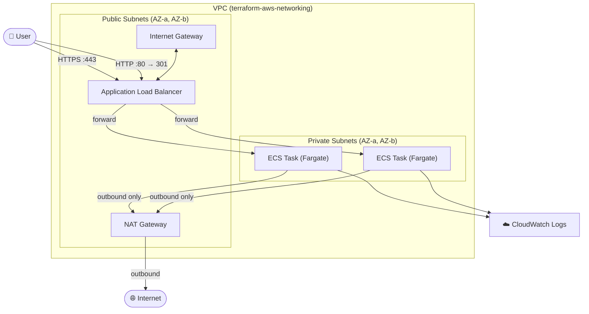

# AWS Terraform Modules

A collection of production-ready Terraform modules for AWS, designed around real-world scenarios rather than raw resource wrappers.

Each module is opinionated by design — it encapsulates security best practices, naming conventions, and architectural decisions that would otherwise need to be repeated across every project.

---

## Philosophy

Most Terraform modules available publicly are thin wrappers around a single AWS resource. These modules take a different approach:

- **Scenario-driven** — each module solves a real infrastructure problem, not just "create a VPC" or "create an ECS cluster"
- **Secure by default** — least-privilege IAM, private networking, HTTPS enforcement, and restrictive security groups are built in, not optional
- **Production conventions** — consistent tagging, environment separation, and naming patterns across all resources
- **Composable** — modules expose the outputs needed to wire them together, but each module can also be used independently with any existing VPC or infrastructure

---

## Modules

| Module | Description | Docs |
| ------ | ----------- | ---- |
| [terraform-aws-networking](modules/terraform-aws-networking/) | Production VPC with public/private subnets, NAT Gateway, and multi-AZ routing | [README](modules/terraform-aws-networking/README.md) |
| [terraform-aws-ecs-service](modules/terraform-aws-ecs-service/) | Fargate ECS service with ALB, HTTPS, IAM execution role, and CloudWatch logging | [README](modules/terraform-aws-ecs-service/README.md) |

---

## Architecture Overview

The modules are designed to be used together. The diagram below shows a typical production deployment using both modules:



---

## Usage

The [modules/examples](modules/examples/) directory contains a working example that provisions the full stack — VPC, subnets, NAT Gateway, ECS cluster, Fargate service, ALB, and HTTPS listener — with both modules wired together. Each module can also be used independently by passing the required network variables manually.

```hcl
module "network" {
  source = "./modules/terraform-aws-networking"

  vpc_cidr           = "10.0.0.0/16"
  project_name       = "my-app"
  environment        = "prod"
  availability_zones = ["us-east-1a", "us-east-1b"]
}

module "ecs" {
  source = "./modules/terraform-aws-ecs-service"

  vpc_id             = module.network.vpc_id
  public_subnet_ids  = module.network.public_subnet_ids
  private_subnet_ids = module.network.private_subnet_ids

  project_name        = "my-app"
  environment         = "prod"
  container_name      = "app"
  container_image     = "my-ecr-repo/app:latest"
  container_port      = 8080
  acm_certificate_arn = "arn:aws:acm:us-east-1:123456789012:certificate/your-certificate-id"
  aws_region          = "us-east-1"
}
```

---

## 💰 Estimated Monthly Cost

Running both modules together with default settings in `us-east-1`:

| Component           | Cost/month  |
| ------------------- | ----------- |
| NAT Gateway         | ~$32.85     |
| Application LB      | ~$16.43     |
| Fargate (1 task, 0.25 vCPU / 512 MB) | ~$5.65 |
| **Total (baseline)**| **~$54.93** |

> Costs scale with traffic, number of tasks, and task size. Data transfer and CloudWatch charges are additional.
> Pricing based on AWS us-east-1 rates — May 2026.

---

## Requirements

| Tool      | Version   |
| --------- | --------- |
| Terraform | >= 1.5.0  |
| AWS Provider | ~> 5.0 |

---

## Author

Built as part of a DevOps portfolio focused on production-grade AWS infrastructure.
Feedback and contributions are welcome.
