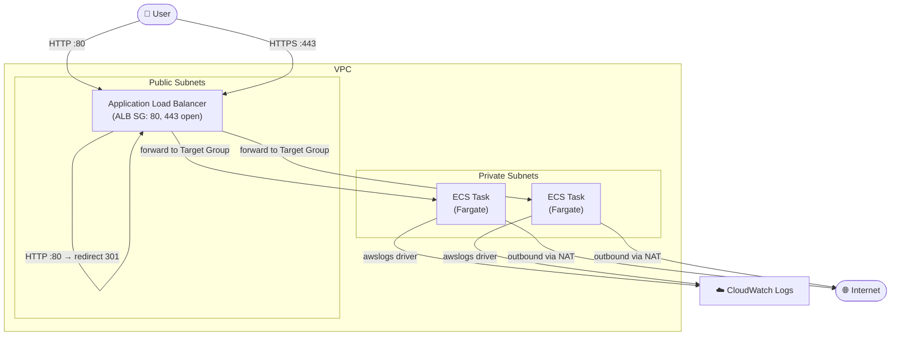

# Terraform AWS ECS Service Module

## 💰 Estimated Monthly Cost (us-east-1)

> Based on default configuration (1 task, 0.25 vCPU, 512 MB) running 24/7. Excludes data transfer and CloudWatch charges.

| Resource                  | Details                                          | Est. Cost/month |
| ------------------------- | ------------------------------------------------ | --------------- |
| Application Load Balancer | 1x, $0.0225/h × 730h (+ LCU, low traffic)       | ~$16.43         |
| Fargate Task (× 1)        | 0.25 vCPU + 0.5 GB, 730h                        | ~$5.65          |
| ECS Cluster               | No charge for the cluster itself                 | $0.00           |
| CloudWatch Logs           | Depends on log volume (~$0.50/GB ingested)       | variable        |
| **Total (baseline)**      |                                                  | **~$22.08/mo**  |

> ⚠️ Costs scale linearly with `desired_count` and task size. A production setup with 2 tasks of 1 vCPU / 2 GB would cost ~$75–$90/mo for compute alone, before ALB and logs.
>
> This module requires a VPC with a NAT Gateway (provisioned by [terraform-aws-networking](../terraform-aws-networking)), which adds ~$32.85/mo.
>
> Pricing sources: [AWS Fargate Pricing](https://aws.amazon.com/fargate/pricing/), [ELB Pricing](https://aws.amazon.com/elasticloadbalancing/pricing/) — May 2026

---

This module provisions a production-style ECS Fargate service with:

* ECS Cluster with optional Container Insights
* Fargate Task Definition with configurable CPU, memory, and container image
* ECS Service running in private subnets
* Application Load Balancer (ALB) in public subnets
* HTTP → HTTPS redirect with TLS 1.3 policy
* IAM Task Execution Role with optional extra policies
* Security Groups with least-privilege rules (ALB → ECS only)
* CloudWatch Log Group with configurable retention

## Architecture

* ALB sits in public subnets, exposed to the internet on ports 80 and 443
* HTTP traffic is automatically redirected to HTTPS (301)
* ECS tasks run in private subnets, unreachable directly from the internet
* The ECS security group only accepts traffic from the ALB security group
* Logs are shipped to CloudWatch via the `awslogs` driver



> The NAT Gateway is provisioned by the [terraform-aws-networking](../terraform-aws-networking) module. This module consumes the subnet IDs it exports.

---

## Usage

```hcl
module "ecs" {
  source = "github.com/your-username/terraform-aws-ecs-service"

  # Network (from terraform-aws-networking outputs)
  vpc_id             = module.network.vpc_id
  public_subnet_ids  = module.network.public_subnet_ids
  private_subnet_ids = module.network.private_subnet_ids

  # Project
  project_name = "my-project"
  environment  = "prod"

  # Container
  container_name  = "app"
  container_image = "nginx:latest"
  container_port  = 8080

  # ECS
  container_insights = true
  desired_count      = 2
  task_cpu           = "512"
  task_memory        = "1024"

  # ALB
  acm_certificate_arn = "arn:aws:acm:us-east-1:123456789012:certificate/abc-123"
  health_check_path   = "/health"

  # Logs
  aws_region    = "us-east-1"
  log_retention = 30

  # Tags
  global_tags = {
    owner = "team-devops"
  }
}
```

---

## Inputs

| Name                       | Description                                                              | Type          | Default  | Required |
| -------------------------- | ------------------------------------------------------------------------ | ------------- | -------- | -------- |
| project_name               | Project identifier                                                       | string        | —        | yes      |
| environment                | Environment name (dev, staging, prod)                                    | string        | —        | yes      |
| vpc_id                     | ID of the VPC                                                            | string        | —        | yes      |
| public_subnet_ids          | List of public subnet IDs for the ALB                                    | list(string)  | —        | yes      |
| private_subnet_ids         | List of private subnet IDs for ECS tasks                                 | list(string)  | —        | yes      |
| container_name             | Name of the container                                                    | string        | —        | yes      |
| container_image            | Container image to run (e.g. `nginx:latest`)                             | string        | —        | yes      |
| acm_certificate_arn        | ARN of the ACM certificate for the HTTPS listener                        | string        | —        | yes      |
| aws_region                 | AWS region used by the CloudWatch Logs driver                            | string        | —        | yes      |
| container_port             | Port exposed by the container                                            | number        | `8080`   | no       |
| container_insights         | Enable ECS Container Insights                                            | bool          | —        | yes      |
| container_definitions      | Custom ECS container definitions JSON. Uses default definition if null   | any           | `null`   | no       |
| task_cpu                   | CPU units for the Fargate task                                           | string        | `"256"`  | no       |
| task_memory                | Memory (MB) for the Fargate task                                         | string        | `"512"`  | no       |
| desired_count              | Number of ECS tasks to run                                               | number        | `1`      | no       |
| execution_role_policy_json | Optional extra IAM policy JSON attached to the task execution role       | string        | `null`   | no       |
| health_check_path          | Health check path for the ALB target group                               | string        | `"/"`    | no       |
| log_retention              | CloudWatch log retention in days                                         | number        | `7`      | no       |
| global_tags                | Additional tags applied to all resources                                 | map(string)   | `{}`     | no       |

---

## Outputs

> This module does not yet declare outputs. Consider adding `alb_dns_name`, `ecs_cluster_name`, and `ecs_service_name` for use by other modules or CI/CD pipelines.

---

## Notes

* The module enforces HTTPS using TLS policy `ELBSecurityPolicy-TLS13-1-2-2021-06`.
* ECS tasks run with `assign_public_ip = false` — outbound internet access requires a NAT Gateway in the VPC.
* The ECS security group only allows inbound traffic from the ALB security group on the container port.
* To provide additional AWS permissions to the container (e.g. S3, Secrets Manager), use `execution_role_policy_json`.
* Container Insights adds cost — recommended for staging and production, optional for dev.

---

## Requirements

* Terraform >= 1.5
* AWS Provider ~> 5.0
