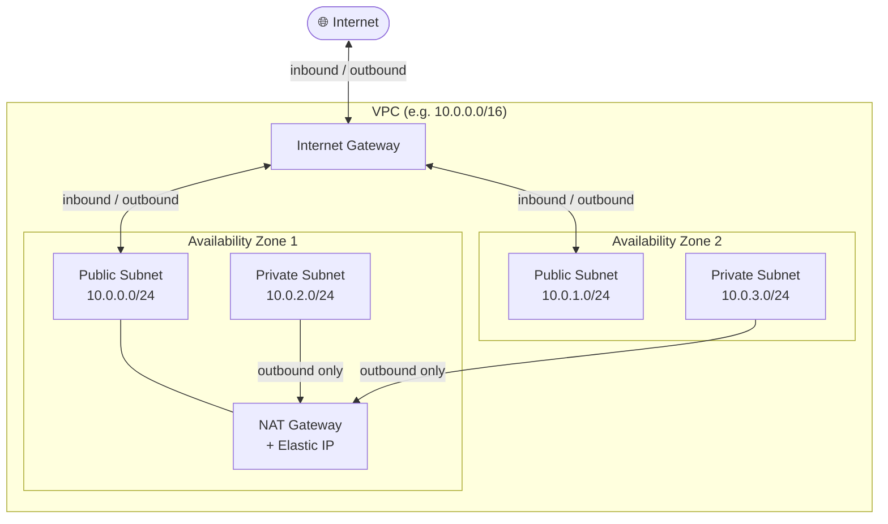

# Terraform AWS Networking Module

## 💰 Estimated Monthly Cost (us-east-1)

> Based on default configuration running 24/7. Excludes data transfer charges.

| Resource        | Details                        | Est. Cost/month |
| --------------- | ------------------------------ | --------------- |
| NAT Gateway     | 1x, $0.045/h × 730h            | ~$32.85         |
| Elastic IP      | Attached to NAT (no extra cost)| $0.00           |
| VPC / Subnets   | No hourly charge               | $0.00           |
| **Total**       |                                | **~$32.85/mo**  |

> ⚠️ The NAT Gateway is the main cost driver of this module. Data processing fees ($0.045/GB) are additional. For dev/test environments, consider removing the NAT Gateway and using VPC Endpoints instead.
>
> Pricing source: [AWS VPC Pricing](https://aws.amazon.com/vpc/pricing/) — May 2026

---

This module provisions a production-style AWS VPC with:

* Public and private subnets
* Internet Gateway
* NAT Gateway
* Route tables for public and private traffic
* Multi-AZ subnet distribution

## Architecture

* 2 public subnets (one per AZ)
* 2 private subnets (one per AZ)
* Public subnets route traffic to an Internet Gateway
* Private subnets route outbound traffic through a NAT Gateway



---

## Usage

```hcl
module "network" {
  source = "github.com/your-username/terraform-aws-networking-module"

  vpc_cidr = "10.0.0.0/16"

  project_name = "my-project"
  environment  = "dev"

  availability_zones = [
    "us-east-1a",
    "us-east-1b"
  ]

  tags = {
    owner = "team-devops"
  }
}
```

---

## Inputs

| Name               | Description            | Type         | Required |
| ------------------ | ---------------------- | ------------ | -------- |
| vpc_cidr           | CIDR block for the VPC | string       | yes      |
| project_name       | Project identifier     | string       | yes      |
| environment        | Environment name       | string       | yes      |
| availability_zones | List of AZs            | list(string) | yes      |
| tags               | Additional tags        | map(string)  | no       |

---

## Outputs

| Name                       | Description                        |
| -------------------------- | ---------------------------------- |
| vpc_id                     | ID of the VPC                      |
| vpc_cidr_block             | CIDR block of the VPC              |
| public_subnet_ids          | IDs of the public subnets          |
| public_subnet_cidr_blocks  | CIDR blocks of the public subnets  |
| private_subnet_ids         | IDs of the private subnets         |
| private_subnet_cidr_blocks | CIDR blocks of the private subnets |
| natgateway_id              | ID of the NAT Gateway              |

---

## Notes

* The module derives subnet CIDRs automatically from the VPC CIDR.
* The module uses a single NAT Gateway for cost efficiency.
* Subnets are distributed across two Availability Zones.

---

## Requirements

* Terraform >= 1.5
* AWS Provider ~> 5.0
