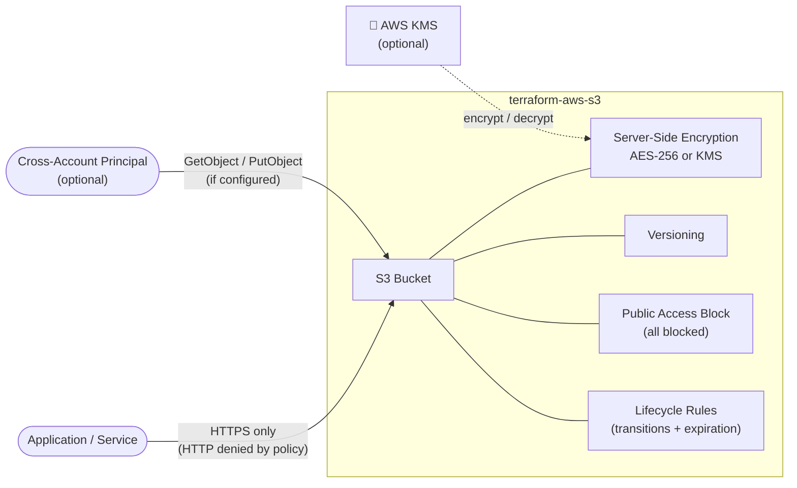

# Terraform AWS S3 Module

## 💰 Estimated Monthly Cost (us-east-1)

> S3 pricing is consumption-based. The module itself has no fixed hourly cost.

| Resource              | Details                                      | Est. Cost         |
| --------------------- | -------------------------------------------- | ----------------- |
| S3 Storage            | $0.023/GB (Standard)                         | depends on usage  |
| S3 Requests           | $0.0004 per 1,000 PUT/COPY/POST/LIST         | depends on usage  |
| KMS (if enabled)      | $1.00/key/month + $0.03 per 10,000 API calls | ~$1.00+/mo        |
| **Baseline (empty bucket)** |                                        | **~$0.00/mo**     |

> Pricing source: [AWS S3 Pricing](https://aws.amazon.com/s3/pricing/) — May 2026

---

This module provisions a production-ready S3 bucket with:

* Public access fully blocked
* Versioning (enabled by default)
* Server-side encryption — AES-256 by default, KMS optionally
* Bucket policy enforcing HTTPS-only access
* Optional cross-account access policy
* Flexible lifecycle rules for cost optimization

## Architecture



---

## Usage

### Basic — SSE-S3 encryption, versioning enabled

```hcl
module "s3" {
  source = "github.com/your-username/terraform-aws-s3"

  project_name  = "my-app"
  environment   = "prod"
  bucket_suffix = "assets"

  global_tags = {
    owner = "team-devops"
  }
}
```

### With KMS encryption and lifecycle rules

```hcl
module "s3" {
  source = "github.com/your-username/terraform-aws-s3"

  project_name  = "my-app"
  environment   = "prod"
  bucket_suffix = "backups"

  kms_key_arn = "arn:aws:kms:us-east-1:123456789012:key/your-key-id"

  lifecycle_rules = [
    {
      id      = "transition-to-ia"
      enabled = true
      transitions = [
        { days = 30,  storage_class = "STANDARD_IA" },
        { days = 90,  storage_class = "GLACIER" }
      ]
      noncurrent_version_expiration_days = 60
    }
  ]

  global_tags = {
    owner = "team-devops"
  }
}
```

### With cross-account access

```hcl
module "s3" {
  source = "github.com/your-username/terraform-aws-s3"

  project_name  = "my-app"
  environment   = "prod"
  bucket_suffix = "artifacts"

  cross_account_arns = [
    "arn:aws:iam::111122223333:role/ci-deploy-role"
  ]

  global_tags = {
    owner = "team-devops"
  }
}
```

---

## Inputs

| Name                | Description                                                              | Type          | Default  | Required |
| ------------------- | ------------------------------------------------------------------------ | ------------- | -------- | -------- |
| project_name        | Project identifier used in resource naming                               | string        | —        | yes      |
| environment         | Environment name (dev, staging, prod)                                    | string        | —        | yes      |
| bucket_suffix       | Suffix identifying the bucket purpose (e.g. `assets`, `backups`)        | string        | —        | yes      |
| versioning_enabled  | Enable versioning on the bucket                                          | bool          | `true`   | no       |
| kms_key_arn         | KMS key ARN for encryption. If null, AES-256 (SSE-S3) is used           | string        | `null`   | no       |
| cross_account_arns  | IAM principal ARNs from other accounts allowed to read/write the bucket  | list(string)  | `null`   | no       |
| lifecycle_rules     | List of lifecycle rule objects (see variable description for schema)     | any           | `[]`     | no       |
| global_tags         | Additional tags applied to all resources                                 | map(string)   | `{}`     | no       |

---

## Outputs

| Name                        | Description                                      |
| --------------------------- | ------------------------------------------------ |
| bucket_id                   | Name of the S3 bucket                            |
| bucket_arn                  | ARN of the S3 bucket                             |
| bucket_domain_name          | Bucket domain name (e.g. for CloudFront origin)  |
| bucket_regional_domain_name | Regional bucket domain name                      |

---

## Notes

* All public access is blocked unconditionally — this is not configurable by design.
* HTTP requests are denied at the bucket policy level regardless of IAM permissions.
* When `kms_key_arn` is provided, `bucket_key_enabled` is set to `true` to reduce KMS API call costs.
* Lifecycle rules only take effect when `versioning_enabled = true` for `noncurrent_version_*` rules.
* The bucket name follows the pattern `{project_name}-{environment}-{bucket_suffix}`. Ensure the resulting name is globally unique and complies with S3 naming rules (lowercase, no underscores).

---

## Requirements

* Terraform >= 1.5
* AWS Provider ~> 5.0
